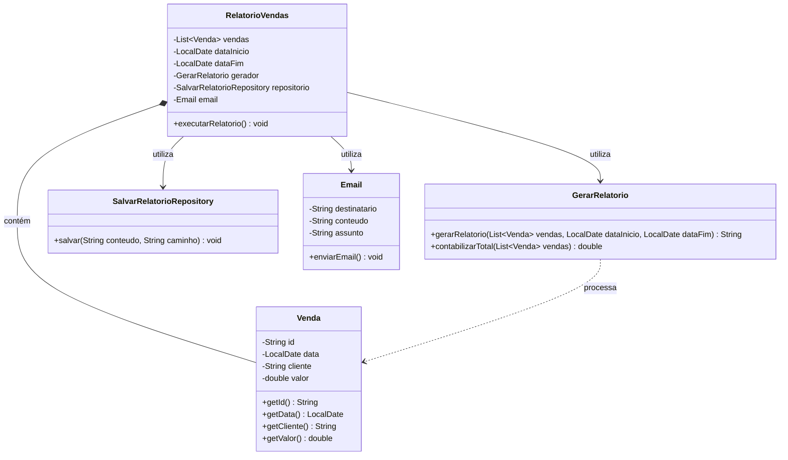

## Exercicio 1

# Explique por que essa classe viola o SRP.
- Por suas funções não realizem somente uma ação, salvarRelatorio() por exemplo chama gerarRelatorio, logo ele gera e salva, e não apenas salva. Assim como enviarRelatorioPorEmail(), que também gera o relatorio para enviar, ao invés de receber o relatorios e email para somente enviar.

# Liste pelo menos três responsabilidades diferentes que ela está assumindo.
- salvar o relatorio 
- enviar o email
- contabilizando o total de vendas

# Proponha uma nova estrutura de classes usando um diagrama de classes que distribua essas responsabilidades de forma mais adequada.


## Exercicio 2

# Explique quais problemas o código atual apresenta em relação ao OCP.
- Será necessário adicionar manualmente na condição as novas maneiras de calcular.

# Proponha uma implementação criando uma interface chamada TipoEntrega e classes concretas para cada tipo de entrega, de forma que cada tipo de entrega tenha um método calcularFrete(double peso).

```
public abstract interface TipoEntrega {
  public abstract double calcularFrete(double peso);
}

public class CalcularFrenteNormal implements TipoEntrega {
  public double calcularFrete(10.0) { ... }
}

public class CalcularFrenteRapido implements TipoEntrega {
  public double calcularFrete(0.3) { ... }
}

public class Frete {
  public double calcularFrete(TipoEntrega te) {
    return te.calcularFrete();
  }
}
``` 

## Exercicio 3 

# Explique, com suas palavras, quando uma subclasse viola o Princípio da Substituição de Liskov (LSP).
- A subclasse viola os pricipios quando é definida como subclasse de uma abstração não necessária. Ou quando deixa de ser filha de uma classe maior.

# Descreva um cenário de uso em que ContaSalario poderia causar um comportamento inesperado ou incorreto ao ser utilizada onde o sistema esperava receber uma Conta genérica.
- No cenário de eu utilizar uma ContaSalario e querer realizar uma transferencia comum como nas outras contas.

# Explique por que o problema apresentado está relacionado ao comportamento esperado da classe, e não simplesmente à existência dos mesmos métodos na classe filha
- Por se tratar de uma abstração, esperasse que a subclasse realize as mesmas operações que outras subclasses com a mesma classe pai fazem.

## Exercicio 4

# Explique por que essa interface pode violar o ISP.
- Por conter métodos que suas em suas classes não realizam. Visto que um Robo não pode dormir(), e um Funcionario não pode comer() KKKK essa parte do funcionário é brincadeira.

# Proponha um conjunto de interfaces menores que segregue melhor as responsabilidades. Escreva a nova definição dessas interfaces em pseudocódigo (ou sintaxe de alguma linguagem OO) e indique quais seriam implementadas por Robo e por Funcionario.
```
public interface SerHumano {
  void comer();
  void dormir();
}

public interface Trabalhador {
  void trabalhar();
}

public class Robo implements Trabalhador { ... }
public class Funcionario implements SerHumano, Trabalhador { ... }
```

## Exercicio 5

# Explique por que isso fere o DIP.
- No exemplo dado estou passando diversas funções em um cenário no qual eu posso estar querendo utilizar somente uma delas. Exemplo, se eu estou processando uma pagamento, não preciso saber de cancelar o pagamento no momento.

# Quais seriam as consequências de manter essa dependência direta em termos de manutenção e evolução do sistema?
- Não devo depender de um método filho, mas sim da abstração. Pois digamos que futuramente eu realize uma implemnetação para um funcionalidade especifica que utiliza desse filho, isso pode quebrar o cenário de utilização em outros locais.

# Descreva brevemente por quais maneiras o desenvolvedor poderia injetar a implementação concreta.
```
public interface PagInseguro  {
  void processarPagamento();
  void verificarPagamento();
  void cancelarPagamento();
}

public class Pagamento implements PagInseguro {
  public void processarPagamento() { ... }
}

public class ProcessadorDePagamento {
  public void processarPagamento(Pagamento pagode) {
    pagode.processarPagamento();
  }
}
```